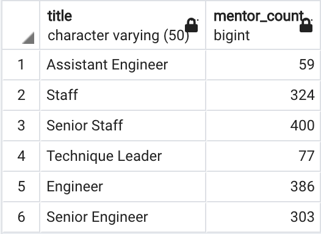

# Pewlett-Hackard-Analysis

## Overview of the Analysis
The purpose of this project is to analyze the human resource data of a tech giant company Pewlett Hackard to prepare for the “silver tsunami” as many current employees reach retirement age. So after creating an employee database with SQL schema, the goal of the analysis is twofold: (1) determine the number of retiring employees and their position titles, and (2) identify employees who are eligible to participate in a mentorship program. 

## Results
#### 1. Analysis of the number of retiring employees who were born between 1952 and 1955 by title
[retiring_titles.csv](Data/retiring_titles.csv)

* The table shows that there are 25916  Senior Engineers and 24926 Senior Staff retiring soon. The two senior positions account for about 70% of the total retiree amount. 
* The second-tier priority group is regular Engineer and Staff postions, as there are 9285 and 7636 positions to be filled, respectively. 

#### 2. Analysis of the number of employees eligible for the mentorship program
Data sample of the [mentorship_eligibility.csv](Data/mentorship_eligibility.csv)
 
* The table shows that there are 1549 employees born in 1965 having management, senior or regular level positions. They are eligible for mentoring in the new mentorship program.

72,458 retiring 
1549 mentors

## Summary
The analysis will help future approval of Pewlett-Hackard by generating a list of all employees eligible for the retirement package.  

The total number of positions that need to be filled as the "silver tsunami" begins to make an impact.

`SELECT COUNT(emp_no) AS total_positions_to_be_filled
FROM unique_titles;`

Number of qualified, retirement-ready employees in the departments to mentor the next generation of Pewlett Hackard employees.

`SELECT COUNT(emp_no) AS total_mentors
FROM mentorship_eligibility;`

Mentors eligible per title 

`SELECT title, COUNT(emp_no) AS mentor_count
FROM mentorship_eligibility 
GROUP BY title;`

## Resources
Software:
* PostgreSQL 12
* pgAdmin 4
 
