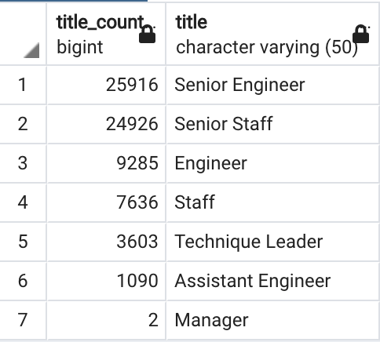
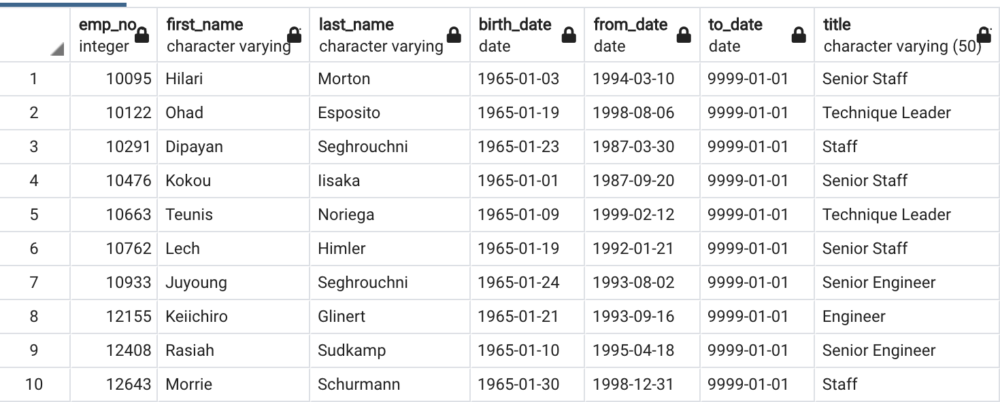
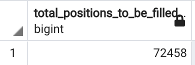
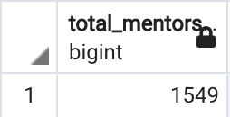
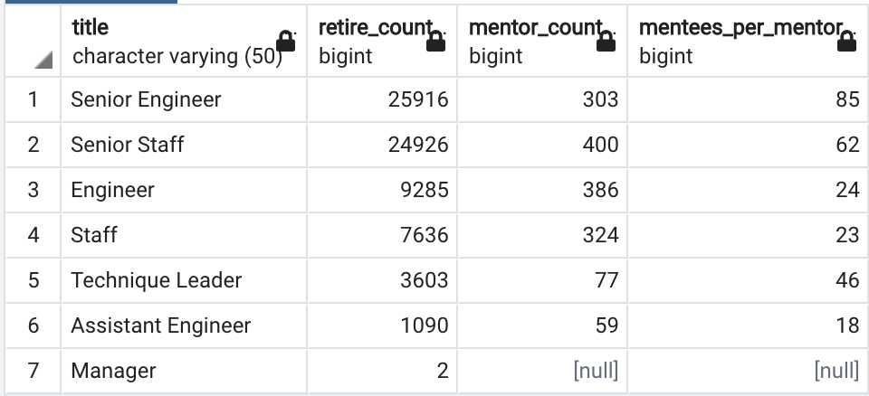

# Pewlett-Hackard-Analysis

## Overview of the Analysis
The purpose of this project is to analyze the human resource data of a tech giant company Pewlett Hackard to prepare for the “silver tsunami” as many current employees reach retirement age. So after creating an employee database with SQL schema, the following analysis reports need to be generated:
* The number of retiring employees and their position titles
* The number of employees who are eligible to participate in a mentorship program. 

The analysis concludes by providing the HR manager with the information for the number of roles that need to be filled and if there are enough employees in the departments to mentor the next generation of Pewlett Hackard employees.

## Background
Pewlett Hackard is a large high-tech company with a huge number of employees. The company has been around for a long time and baby boomers begin to retire at a rapid rate. I have been working on this project to help Pewlett Hackard to get ready for the future by analyzing employee data using SQL. The company has been relying on Excel in the past, so the first step is to build an employee data base with SQL by creating 6 tables to hold the csv files: departments, employees, managers, dept_emp, titles and salaries. [Pewlett_Hackard Data](Data/)

Then, I used SQL queries to further analyze the data and created tables and csv data files to hold all retiring employees’ information: retirement_info, retirement_titles, retirement_dept, and manager_info, etc. These data are very helpful for the company to conclude results such as who are retiring, which departments have the most retiring employees, how many management team members are retiring etc.

## Results
#### 1. Analysis of the number of retiring employees who were born between 1952 and 1955 by title
[retiring_titles.csv](Data/retiring_titles.csv)

* The table shows that there are 25916  Senior Engineers and 24926 Senior Staff retiring soon. The two senior positions account for about 70% of the total retiree amount. 
* The second-tier priority group is regular Engineer and Staff postions, as there are 9285 and 7636 positions to be filled, respectively. 
* Only 2 manager positions need to be filled soon. 

#### 2. Analysis of the number of employees eligible for the mentorship program
Data sample of the [mentorship_eligibility.csv](Data/mentorship_eligibility.csv)
 
* The table shows that there are 1549 employees born in 1965 having mid- to senior-level positions, who are eligible and for mentoring in the new mentorship program.

## Summary
#### Total number of positions that need to be filled as the "silver tsunami" begins to make an impact.

`SELECT COUNT(emp_no) AS total_positions_to_be_filled
FROM unique_titles;`

#### Total number of qualified, retirement-ready employees in the departments to mentor the next generation of Pewlett Hackard employees.

`SELECT COUNT(emp_no) AS total_mentors
FROM mentorship_eligibility;`

According to the above results, there will be a significan amount (72458) of future retirees, especially those holding senior positions which account for 70% of the job vacancies, while there are only 1549 total eligible mentors. Therefore, there are not enough mentors to train all of the roles to be filled. To help the Pewlett-Hackard HR department manager better plan for the mentorship program, we could do a further analysis by creating a table to list the number of retirees and number of mentors for each title, and the ratio of mentor to mentees per title.  

#### Table of mentees_per_mentor ratio

The above table provides more insights on how many mentees a mentor will take on to fulfill the retired roles: 
* The entry-level and mid-level positions like Assistant Engineer, Engineer, and Staff titles are in a good 20:1 (approximately) mentees per mentor ratio. 
* For the senior-level positions like Senior Engineer, Senior Staff, Technique Leader, the mentees per mentor ratio are too high, ranging from 46:1 to 85:1. So the HR department is recommended to plan to increase the amount of the eligible senior mentor pool internally or hire some senior employees externally.
* For the 2 executive-level manager positions, there is no eligible mentor available. Therefore, Pewlett-Hackard might need to hire the two managers externally. 

## Resources
Software:
* PostgreSQL 12
* pgAdmin 4
 
